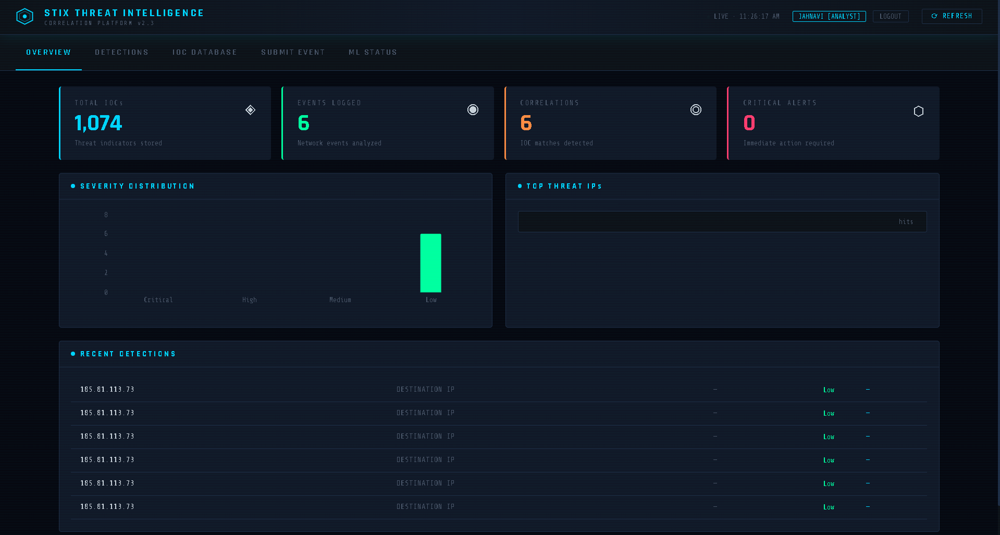
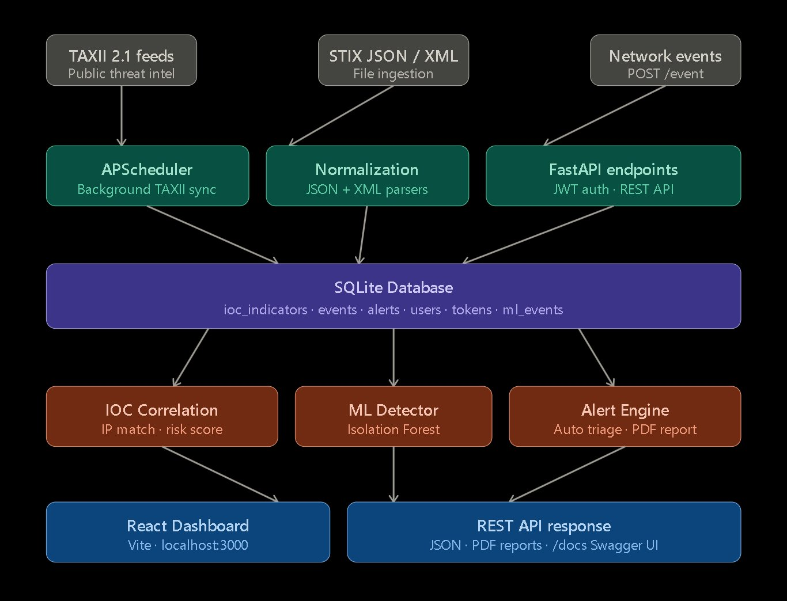

# STIX 2.1 Threat Intelligence Platform

**A tool that watches for cyber threats in real time — ingesting known bad IPs and domains, checking every network event against them, and alerting analysts when something suspicious appears.**

[](https://github.com/Jahnavi-Hub02/stix-threat-intel-platform/actions)
[](https://python.org)
[](https://github.com/Jahnavi-Hub02/stix-threat-intel-platform)

---

## What does it do?

Imagine your network is handling thousands of connections a second. This platform helps you answer one question: **"Is any of this traffic talking to a known threat?"**

It works in three steps:

1. **Collect** — Downloads lists of known malicious IPs and domains from public threat feeds (TAXII/STIX format) and stores 1,074+ indicators locally.
2. **Check** — When you submit a network event (a connection log), it runs two checks: "Have we seen this IP before?" and "Does this traffic pattern look unusual?"
3. **Alert** — If either check flags something, it creates an alert for an analyst to investigate, and generates a PDF report.

---

## Dashboard



The dashboard shows at a glance:
- **Total IOCs** — threat indicators loaded (1,074+)
- **Events logged** — network connections analyzed
- **Correlations** — how many matched a known threat
- **Critical alerts** — items needing immediate attention
- **Severity chart** — breakdown of threat levels (Critical / High / Medium / Low)
- **Recent detections** — the latest flagged events in real time

---

## Architecture

How data flows through the platform — from raw threat feeds to analyst alerts:



---

## Getting started

You need **Python 3.11** and **Node.js 18+** installed.

> Python 3.11 is recommended and fully tested. Python 3.12 is also supported and tested in CI.

### 1. Clone the repository

```bash
git clone https://github.com/Jahnavi-Hub02/stix-threat-intel-platform.git
cd stix-threat-intel-platform
```

### 2. Create a Python 3.11 environment

```powershell
# Windows
py -3.11 -m venv venv
.\venv\Scripts\Activate.ps1

# Mac / Linux
python3.11 -m venv venv
source venv/bin/activate
```

Verify it worked: `python --version` → should say `Python 3.11.x`

### 3. Install dependencies

```bash
pip install -r requirements.txt
```

### 4. Set a secret key

```powershell
# Windows
$env:JWT_SECRET_KEY = "pick-any-long-random-string-here"

# Mac / Linux
export JWT_SECRET_KEY="pick-any-long-random-string-here"
```

This secures login tokens. Pick any long string and keep it private.

### 5. Start the backend

```bash
uvicorn app.api.main:app --reload --port 8000
```

Open `http://localhost:8000/docs` — you'll see every API endpoint with a built-in test interface.

### 6. Start the dashboard (optional)

In a second terminal:

```bash
cd frontend
npm install    # first time only
npm run dev    # opens http://localhost:3000 (direct)
# Note: when running via Docker Compose, the frontend is served on http://localhost:5173
```

### 7. Load threat data

```bash
python run.py
```

This loads 1,074 real threat indicators so you have data to work with immediately.

---

## Your first threat check

**Create an account:**
```bash
curl -X POST http://localhost:8000/auth/register \
  -H "Content-Type: application/json" \
  -d '{"username":"analyst1","password":"MyPass123!","role":"analyst"}'
```

**Log in and copy the `access_token` from the response:**
```bash
curl -X POST http://localhost:8000/auth/login \
  -H "Content-Type: application/json" \
  -d '{"username":"analyst1","password":"MyPass123!"}'
```

**Submit a network event:**
```bash
curl -X POST http://localhost:8000/event \
  -H "Authorization: Bearer YOUR_ACCESS_TOKEN" \
  -H "Content-Type: application/json" \
  -d '{
    "event_id": "evt-001",
    "source_ip": "192.168.1.10",
    "destination_ip": "185.220.101.45",
    "protocol": "TCP",
    "destination_port": 443
  }'
```

The response shows you: whether the IP is a known threat, a risk score from 0–100, and whether the ML model considers the traffic unusual.

---

## User roles

| Role | What they can do |
|---|---|
| `viewer` | Read alerts, browse the IOC database, view metrics |
| `analyst` | All of viewer + submit events, triage alerts, train the ML model |
| `admin` | All of analyst + manage user accounts |

---

## Key terms explained

**IOC** (Indicator of Compromise) — a known bad IP, domain, or URL. Like a blocklist entry. When traffic matches one, it gets flagged.

**STIX** — a standard file format for sharing threat intelligence. The platform reads `.json` and `.xml` STIX files.

**TAXII** — a protocol for downloading STIX files automatically from threat servers. The scheduler does this every 30 minutes in the background.

**Isolation Forest** — the machine learning algorithm used here. It learns what "normal" traffic looks like, then flags anything that stands out. No manual labelling required.

**JWT** — the login system. After you log in, you get a short-lived token (like a temporary ID badge) that proves who you are on every request.

---

## Project layout

```
stix-threat-intel-platform/
│
├── app/                     ← All backend Python code
│   ├── api/main.py          ← Entry point — all API routes defined here
│   ├── auth/                ← Login, tokens, user management
│   ├── alerts/              ← Alert creation and triage workflow
│   ├── correlation/         ← Checks events against the IOC database
│   ├── ml/                  ← Isolation Forest anomaly detection
│   ├── ingestion/           ← Downloads and parses threat feeds
│   ├── database/            ← Reads and writes the SQLite database
│   └── utils/               ← PDF reports, logging helpers, IP tools
│
├── tests/                   ← 297 automated tests (all passing)
├── frontend/                ← React dashboard (runs separately)
├── data/                    ← Bundled STIX feed files (1,074+ indicators)
├── requirements.txt         ← Python packages to install
├── run.py                   ← Loads the initial threat data
├── Dockerfile               ← For running with Docker
└── .env.example             ← Copy this to .env and fill in your values
```

---

## Running the tests

```powershell
$env:JWT_SECRET_KEY = "test-key"
$env:PYTHONPATH    = "."
pytest tests/ -v --tb=short
```

Expected result: **297 passed, 0 failed**

---

## Configuration

Copy `.env.example` to `.env` and set your values:

```bash
cp .env.example .env
```

| Variable | Default | What it controls |
|---|---|---|
| `JWT_SECRET_KEY` | required | Signs login tokens — keep this private |
| `JWT_EXPIRE_MINUTES` | `30` | How long a login token stays valid |
| `ML_MIN_TRAIN_SAMPLES` | `50` | Events needed before the ML model trains itself |
| `ML_CONTAMINATION` | `0.05` | How many anomalies to expect (5 in every 100 events) |

---

## What's planned next

- [ ] Export matched threats as STIX 2.1 bundles (`GET /export/stix`)
- [ ] Real-time alert stream via WebSocket
- [ ] Migrate to PostgreSQL for larger deployments
- [ ] Explain why the ML model flagged something (SHAP feature importance)
- [ ] Let analysts mark false positives to improve the model over time

---

## License

MIT — free to use and modify.