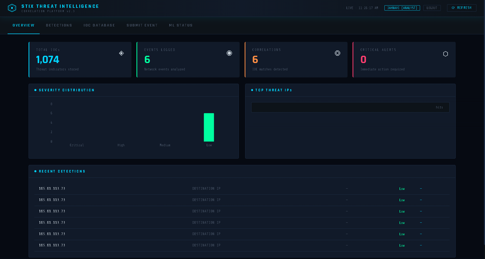
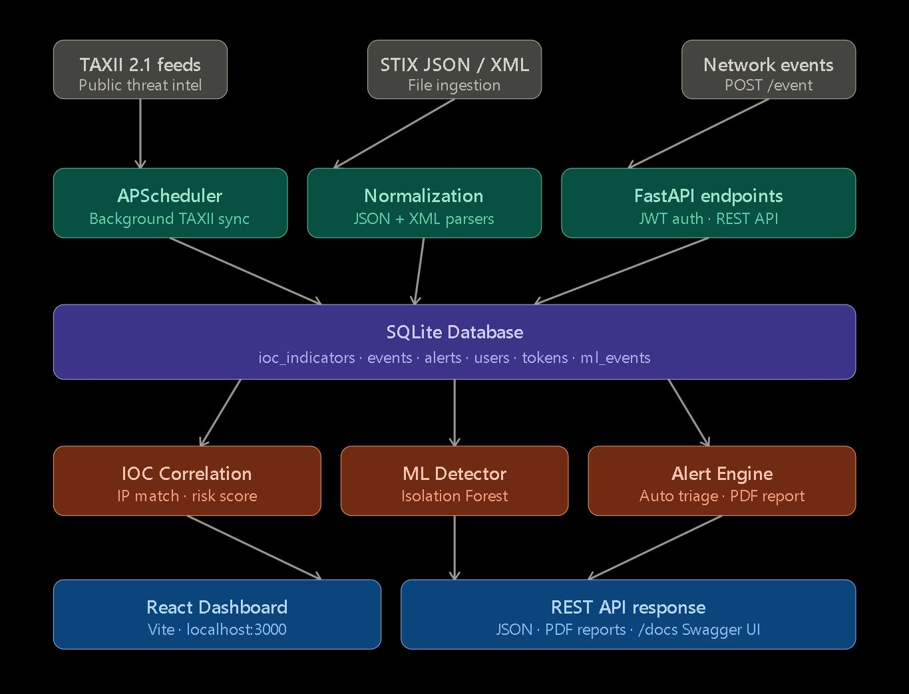

# STIX 2.1 Threat Intelligence Platform

**A full-stack threat intelligence platform that ingests live STIX/TAXII threat feeds, correlates every network event against known IOCs, runs dual-layer ML anomaly detection, and alerts analysts in real time.**

[](https://github.com/Jahnavi-Hub02/stix-threat-intel-platform/actions)
[](https://python.org)
[](https://fastapi.tiangolo.com)
[](https://react.dev)
[](https://github.com/Jahnavi-Hub02/stix-threat-intel-platform)

---

## What does it do?

Imagine your network is handling thousands of connections a second. This platform helps you answer: **"Is any of this traffic talking to a known threat — and does it look suspicious even if we've never seen it before?"**

It works in four phases:

1. **Collect** — Polls live TAXII 2.1 servers (AlienVault OTX, CISA AIS, etc.) every 30 minutes and **upserts** indicators into the local database — new IOCs are inserted, existing ones get updated attributes if the threat feed changes them.
2. **Check** — When a network event arrives, two checks run in parallel: a fast SQL lookup against 1,074+ stored IOCs, and a dual-layer ML analysis (Isolation Forest + Random Forest classifier).
3. **Alert** — If either check flags something, an alert is created and a PDF report is generated automatically.
4. **Analyze** — Upload any log file (Apache, Nginx, syslog, firewall) and the platform scans every line using both IOC matching and ML threat detection.

---

## Dashboard



The dashboard shows at a glance:
- **Total IOCs** — threat indicators loaded (1,074+)
- **Events logged** — network connections analyzed
- **Correlations** — how many matched a known threat
- **Critical alerts** — items needing immediate attention
- **Severity chart** — breakdown of all four threat levels (Critical / High / Medium / Low) — all sourced from the database, not estimated client-side
- **Recent detections** — the latest flagged events in real time

---

## Architecture

How data flows through the platform — from raw threat feeds to analyst alerts:



---

## Getting started

You need **Python 3.11** and **Node.js 18+** installed.

> Python 3.11 is recommended and fully tested. Python 3.12 is also supported and tested in CI.

### 1. Clone the repository

```bash
git clone https://github.com/Jahnavi-Hub02/stix-threat-intel-platform.git
cd stix-threat-intel-platform
```

### 2. Create a Python virtual environment

```powershell
# Windows
py -3.11 -m venv venv
.\venv\Scripts\Activate.ps1

# Mac / Linux
python3.11 -m venv venv
source venv/bin/activate
```

Verify: `python --version` → should say `Python 3.11.x`

### 3. Install dependencies

```bash
pip install -r requirements.txt
```

### 4. Configure environment

```bash
# Copy the template
cp .env.example .env   # Mac/Linux
copy .env.example .env  # Windows
```

Generate a secure JWT secret and add it to `.env`:

```bash
python -c "import secrets; print(secrets.token_hex(32))"
```

Then edit `.env`:
```
JWT_SECRET_KEY=<paste the generated key here>
```

> ⚠️ The server will **refuse to start** if `JWT_SECRET_KEY` is not set. This protects against accidentally running with an insecure random key that changes on every restart.

### 5. Load initial threat data

```bash
python run.py
```

This loads 1,074 real threat indicators (from bundled STIX JSON + XML feeds) so you have data to work with immediately.

### 6. Start the backend

```bash
uvicorn app.api.main:app --reload --port 8000
```

Open `http://localhost:8000/docs` — interactive API documentation with built-in test interface.

### 7. Start the dashboard

In a second terminal:

```bash
cd frontend
npm install    # first time only
npm run dev    # opens http://localhost:5173
```

---

## Your first threat check

**Register an account:**
```bash
curl -X POST http://localhost:8000/auth/register \
  -H "Content-Type: application/json" \
  -d '{"username":"analyst1","password":"MyPass123!","role":"analyst"}'
```

**Log in — copy `access_token` from the response:**
```bash
curl -X POST http://localhost:8000/auth/login \
  -H "Content-Type: application/json" \
  -d '{"username":"analyst1","password":"MyPass123!"}'
```

**Submit a network event:**
```bash
curl -X POST http://localhost:8000/event \
  -H "Authorization: Bearer YOUR_ACCESS_TOKEN" \
  -H "Content-Type: application/json" \
  -d '{
    "event_id": "evt-001",
    "source_ip": "192.168.1.10",
    "destination_ip": "185.220.101.45",
    "protocol": "TCP",
    "destination_port": 443
  }'
```

Response includes: IOC match result, ML anomaly score (0–100), classifier verdict, severity, and a PDF report link.

**Analyze a log file:**
```bash
curl -X POST http://localhost:8000/logs/full \
  -H "Authorization: Bearer YOUR_ACCESS_TOKEN" \
  -F "file=@/path/to/access.log"
```

Returns every line that matched a known IOC or was flagged by ML, with line numbers and severity.

---

## Live TAXII polling

The scheduler starts automatically when the server boots. It polls configured TAXII feeds every 30 minutes using delta mode (only fetches IOCs added in the last 24 hours).

**Check scheduler status:**
```bash
curl http://localhost:8000/scheduler/status \
  -H "Authorization: Bearer YOUR_ACCESS_TOKEN"
```

**Trigger a manual ingestion:**
```bash
curl -X POST http://localhost:8000/ingest/taxii \
  -H "Authorization: Bearer YOUR_ACCESS_TOKEN"
```

Configure feeds in `.env`:
```
FEED_1_NAME=AlienVault OTX
FEED_1_URL=https://otx.alienvault.com/taxii/taxii2/
FEED_1_AUTH=api_key
FEED_1_API_KEY=your-otx-api-key
FEED_1_ENABLED=true
```

---

## Log analysis

The platform supports two modes of log analysis, both accessible from the dashboard and API:

| Mode | What it does |
|------|-------------|
| **IOC-based** (`POST /logs/check`) | Extracts IPs, domains, URLs, hashes from each log line and checks against the IOC database |
| **ML-based** (`POST /logs/analyze`) | Parses each line as a network event and runs both ML models |
| **Combined** (`POST /logs/full`) | Runs both modes together — recommended |
| **Real-time stream** (`WebSocket /logs/stream`) | Tails a live log file and pushes hits as they appear |

---

## ML anomaly detection

The platform uses a **two-layer ML system:**

| Layer | Algorithm | Purpose |
|-------|-----------|---------|
| Layer 1 | Random Forest (supervised) | Trained on NSL-KDD dataset — classifies known attack types (DoS, PortScan, R2L, U2R) |
| Layer 2 | Isolation Forest (unsupervised) | Learns your normal traffic — flags anything that stands out, even novel attacks |

**Train Layer 1 (offline, on NSL-KDD dataset):**
```bash
# Place KDDTrain+.txt at data/nslkdd/KDDTrain+.txt
curl -X POST http://localhost:8000/ml/train-classifier \
  -H "Authorization: Bearer YOUR_ACCESS_TOKEN" \
  -d '{"sample_size": 10000}'
```

**Layer 2 trains automatically** once 50+ events are collected (configurable via `ML_MIN_TRAIN_SAMPLES`).

---

## User roles

| Role | What they can do |
|------|-----------------|
| `viewer` | Read alerts, browse IOC database, view metrics |
| `analyst` | All of viewer + submit events, triage alerts, train ML models, trigger ingestion |
| `admin` | All of analyst + manage user accounts |

---

## Key terms

**IOC** (Indicator of Compromise) — a known bad IP, domain, URL, or file hash. When traffic matches one, it gets flagged immediately.

**STIX** — standard format for sharing threat intelligence. The platform reads `.json` and `.xml` STIX 2.1 files and polls live TAXII servers.

**TAXII** — protocol for downloading STIX data automatically from threat servers. The scheduler polls every 30 minutes in the background.

**Upsert** — when a TAXII feed updates an existing indicator (e.g. raises its confidence score), the platform updates the stored record rather than silently ignoring the change.

**Isolation Forest** — an unsupervised ML algorithm that learns what "normal" traffic looks like for your network, then flags anything that deviates. No manual labelling required.

**JWT** — the login system. After login you receive a short-lived access token (30 min default) and a refresh token (7 days default).

---

## Project layout

```
stix-threat-intel-platform/
│
├── app/                      ← All backend Python code
│   ├── api/
│   │   ├── main.py           ← Core API routes (events, IOCs, reports)
│   │   ├── ml.py             ← ML endpoints (train, predict, status)
│   │   ├── logs_router.py    ← Log analysis + WebSocket streaming
│   │   └── alerts_router.py  ← Alert management
│   ├── auth/                 ← JWT auth, password hashing, RBAC
│   ├── ingestion/
│   │   ├── taxii_client.py   ← TAXII 2.x multi-feed client
│   │   ├── scheduler.py      ← Background 30-min polling scheduler
│   │   ├── log_checker.py    ← IOC-based log file analysis
│   │   └── ioc_manager.py    ← IOC expiry and lifecycle management
│   ├── ml/
│   │   ├── detector.py       ← Isolation Forest (Layer 2)
│   │   ├── classifier.py     ← Random Forest (Layer 1)
│   │   ├── log_analyzer.py   ← ML-based log file analysis
│   │   └── features.py       ← Feature extraction from network events
│   ├── database/
│   │   └── db_manager.py     ← SQLite with WAL mode, retry logic, upsert
│   └── utils/                ← PDF reports, logging, IP tools
│
├── tests/                    ← 297 automated tests (all passing)
├── frontend/                 ← React 18 + Recharts dashboard
├── data/                     ← Bundled STIX feeds (1,074+ indicators)
├── docs/screenshots/         ← Dashboard + architecture screenshots
├── requirements.txt          ← Pinned Python dependencies
├── run.py                    ← CLI: initialize DB + load bundled feeds
├── Dockerfile                ← Multi-stage build (React + FastAPI)
├── docker-compose.yml        ← Local dev stack
└── .env.example              ← Copy to .env and fill in your values
```

---

## Running the tests

```bash
# Activate your virtual environment first, then:
pytest tests/ -v --tb=short
```

Expected result: **297 passed, 0 failed**

> No manual `JWT_SECRET_KEY` export needed — `conftest.py` sets a fixed test key automatically.

---

## Docker

```bash
# Build and start everything
docker-compose up --build

# Backend:  http://localhost:8000
# Frontend: http://localhost:5173
# API docs: http://localhost:8000/docs
```

---

## Configuration reference

Copy `.env.example` to `.env` and set your values:

| Variable | Default | What it controls |
|----------|---------|-----------------|
| `JWT_SECRET_KEY` | **required** | Signs login tokens — generate with `secrets.token_hex(32)` |
| `JWT_EXPIRE_MINUTES` | `30` | How long an access token stays valid |
| `JWT_REFRESH_EXPIRE_DAYS` | `7` | How long a refresh token stays valid |
| `ML_MIN_TRAIN_SAMPLES` | `50` | Events needed before Isolation Forest auto-trains |
| `ML_CONTAMINATION` | `0.05` | Expected anomaly fraction (5 per 100 events) |
| `ML_RETRAIN_INTERVAL` | `100` | Auto-retrain every N new events |
| `FEED_1_NAME` | `AlienVault OTX` | Display name for TAXII feed 1 |
| `FEED_1_URL` | — | TAXII server URL for feed 1 |
| `FEED_1_API_KEY` | — | API key for feed 1 (if auth_type=api_key) |
| `FEED_1_ENABLED` | `true` | Enable/disable feed 1 |
| `SCHEDULER_INTERVAL_MINUTES` | `30` | How often TAXII feeds are polled |
| `FRONTEND_URL` | `http://localhost:3000` | Added to CORS allowed origins |

---

## What's planned next

- [ ] Export correlated threats as STIX 2.1 bundles (`GET /export/stix`)
- [ ] SHAP-based ML explanations — show *why* the model flagged an event
- [ ] Analyst false-positive feedback loop to improve model accuracy over time
- [ ] Migrate to PostgreSQL for high-volume deployments
- [ ] Nginx reverse proxy config for production deployment

---

## License

MIT — free to use and modify.